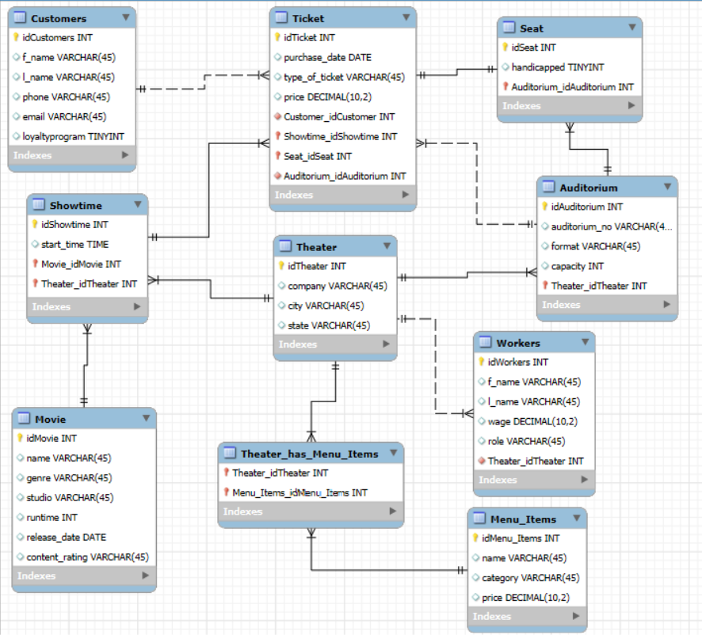
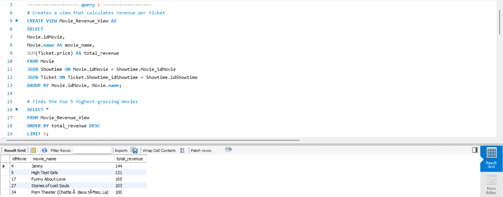
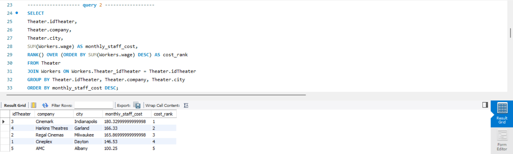
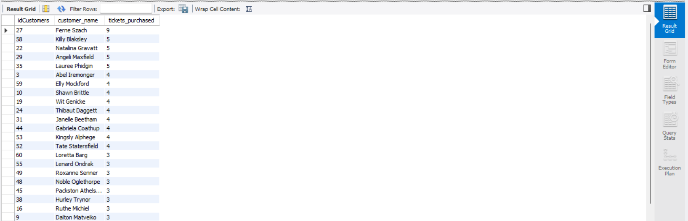
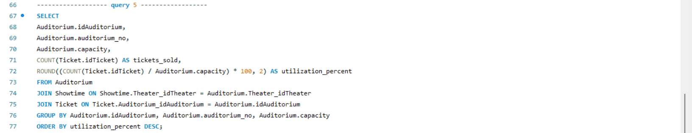
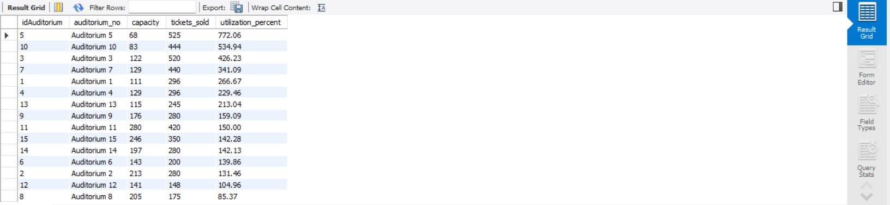
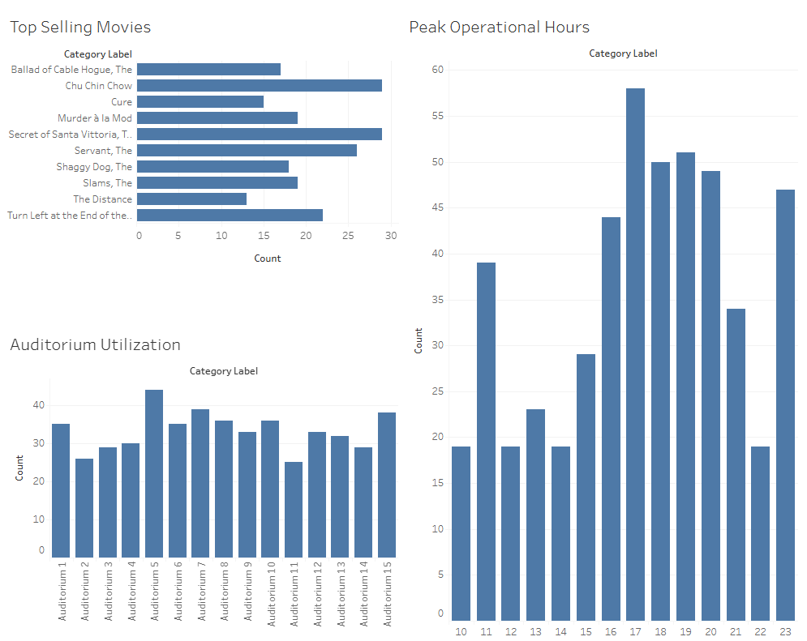

# MIST 4610 Project 2: Movie Theater Management System

Rachel Davies, Hiromichi Kikuchi, Anirudh Pothuri, and Sakshi Sinha

## Description
This movie theater database efficiently manages theater operations, including movie scheduling, ticket sales, auditorium capacity, and customer interactions. It tracks movies, showtimes, and ticket transactions, while also organizing theater rooms and seating arrangements. Customer data is stored to track purchasing history and preferences. The database links customers, tickets, movies, and auditoriums, providing a streamlined system for managing daily box office activities. While comprehensive for operational needs, it focuses on improving efficiency and optimizing the movie-going experience.

- **Movie:** Stores movie details, including title, genre, runtime, and content rating.
- **Showtime:** specific times when movies are screened, linking a movie to a theater room.
- **Ticket:** Transaction records linking customers to specific seats and showtimes.
- **Customer:** Contains customer information like name and email for receipts.
- **Auditorium:** Details about the physical theater rooms and their capacities.
- **Seat:** Specific seating arrangements within each auditorium.
- **Theater:** General theater facility information.
- **Worker:** Employee details for staff managing the theater.
- **Menu_Item:** Concession items available for purchase.
- **Theater_has_Menu_Item:** Tracks which concession items are available at which theater location.

## Data Dictionary

#### Movie
| Column Name | Data Type | Description |
|---|---|---|
| idMovie | INT | Unique identifier for each movie (Primary Key) |
| name | VARCHAR(45) | Title of the movie |
| genre | VARCHAR(45) | Genre of the movie |
| studio | VARCHAR(45) | Production studio of the movie |
| runtime | INT | Duration of the movie in minutes |
| release_date | DATE | Official release date |
| content_rating | VARCHAR(10) | Age restriction rating (e.g., PG, R) |

#### Showtime
| Column Name | Data Type | Description |
|---|---|---|
| idShowtime | INT | Unique identifier for each showtime (Primary Key) |
| start_time | DATETIME | Date and time the movie starts |
| Movie_idMovie | INT | Foreign key linking to the Movie table |
| Theater_idTheater | INT | Foreign key linking to the Theater |

#### Ticket
| Column Name | Data Type | Description |
|---|---|---|
| idTicket | INT | Unique identifier for the ticket (Primary Key) |
| price | DECIMAL(5,2) | Cost of the ticket |
| purchase_date | DATETIME | Date when the ticket was purchased |
| type_of_ticket | VARCHAR(45) | Type (Adult, Child, Senior) |
| Showtime_idShowtime | INT | Foreign key linking to the Showtime |
| Customer_idCustomer | INT | Foreign key linking to the Customer |

#### Customer
| Column Name | Data Type | Description |
|---|---|---|
| idCustomer | INT | Unique identifier for the customer (Primary Key) |
| name | VARCHAR(45) | Full name of the customer |
| email | VARCHAR(45) | Contact email for the customer |

#### Auditorium
| Column Name | Data Type | Description |
|---|---|---|
| idAuditorium | INT | Unique identifier for the auditorium (Primary Key) |
| auditorium_no | VARCHAR(10) | Room number or name |
| capacity | INT | Maximum seating capacity |
| format | VARCHAR(45) | Screen format (e.g., IMAX, Standard) |

#### Seat
| Column Name | Data Type | Description |
|---|---|---|
| idSeat | INT | Unique identifier for the seat (Primary Key) |
| row | VARCHAR(5) | Row letter of the seat |
| number | INT | Seat number in the row |
| Auditorium_idAuditorium | INT | Foreign key linking to the Auditorium |

#### Workers
| Column Name | Data Type | Description |
|---|---|---|
| idWorker | INT | Unique identifier for the employee (Primary Key) |
| name | VARCHAR(45) | Name of the employee |
| position | VARCHAR(45) | Job title (e.g., Usher, Manager) |
| hire_date | DATE | Date the employee was hired |

#### Menu_Item
| Column Name | Data Type | Description |
|---|---|---|
| idMenu_Item | INT | Unique identifier for the food item (Primary Key) |
| name | VARCHAR(45) | Name of the snack or drink |
| price | DECIMAL(5,2) | Cost of the item |
| calories | INT | Caloric content of the item |

## Queries

| Database information | Query 1 | Query 2 | Query 3 | Query 4 | Query 5 |
|---|---|---|---|---|---|
| **Multiple table join** | x | x | x | x | x |
| **Create view** | | | | | |
| **Group by, Aggregation** | x | x | x | x | x |
| **Join** | x | x | x | x | x |

#### 1. Identify Top-Performing Movies by Revenue
Helps managers know which movies generate the most money across all theaters.

#### 2. Determine Theater Staffing Cost per Month
Allows management to assess labor expenses per theater for budgeting.

#### 3. Find Peak Showtime Hours Across All Theaters
Helps managers allocate staff and schedule popular time slots.

#### 4. Identify Customers Who Frequently Attend Movies
Useful for loyalty program targeting, targeted marketing, or upselling.

#### 5. Auditorium Utilization Rate
Helps managers understand which auditoriums are underused or overused and adjust scheduling.

## Tableau Visualizations

### Top Selling Movies
- **Purpose:** This chart displays a ranking of movies by the total number of tickets sold.
- **Relevance:** Helps identify the highest-grossing films currently in rotation, aiding in decisions on which movies to retain and which to drop.

### Peak Operational Hours
- **Purpose:** Shows the count of tickets sold broken down by the hour of the day.
- **Relevance:** Highlights peak operational hours, allowing management to optimize staff scheduling and reduce wait times.

### Auditorium Utilization
- **Purpose:** Compares ticket sales volume across different theater auditoriums.
- **Relevance:** Indicates which rooms are performing best, ensuring popular movies are assigned to larger auditoriums to maximize revenue capacity.
